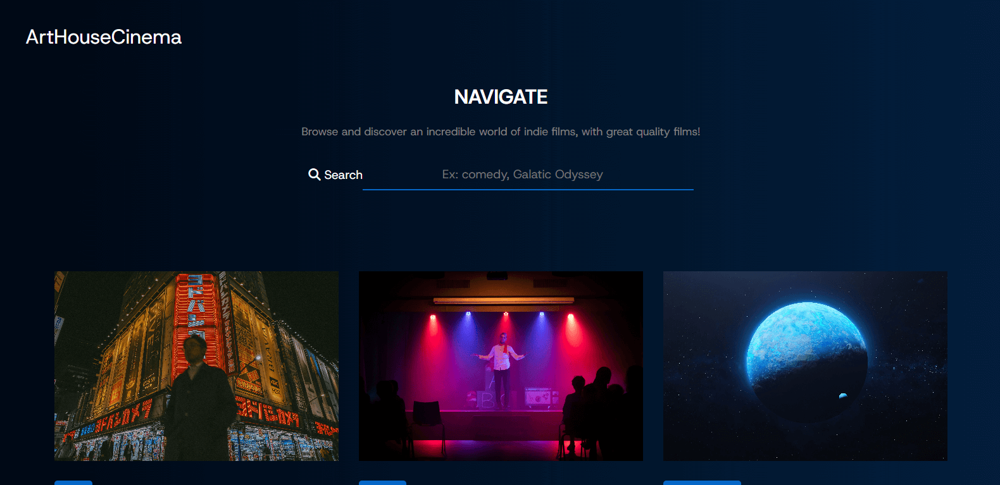

# Description

This project is a **search page for a streaming platform** where users can search for movies by name or category using a search bar. The search functionality is **powered by 
JavaScript**, **which retrieves and displays matching results from a JSON file**. The design is **fully responsive**, ensuring a seamless experience on both mobile devices and larger 
screens. This project blends functionality and user-friendliness to enhance content exploration and navigation.

# Main Features
- HTML CSS
- JavaScript
- Search bar
- Responsive design

# Screenshot

